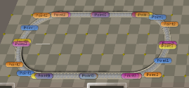
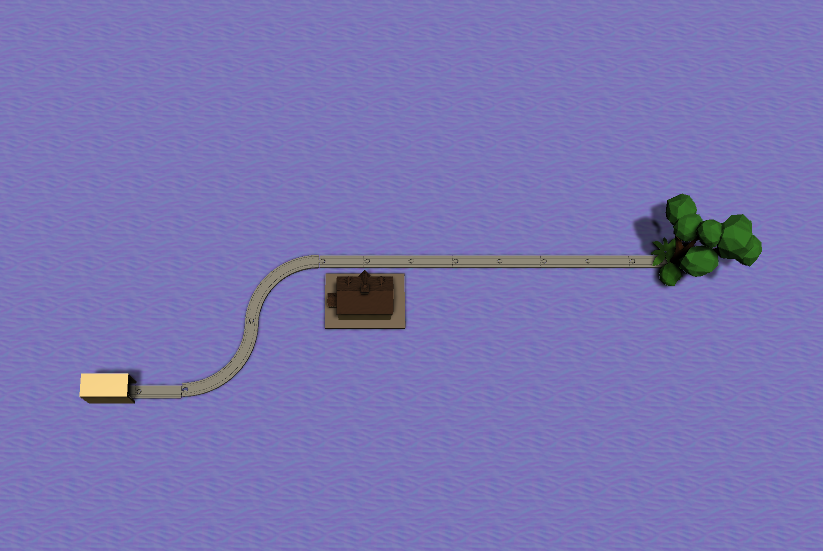
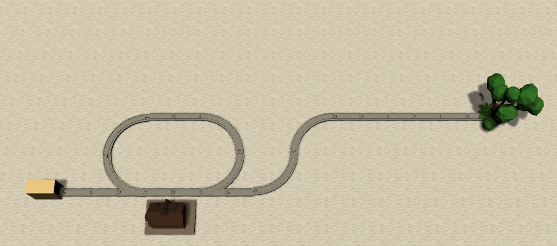
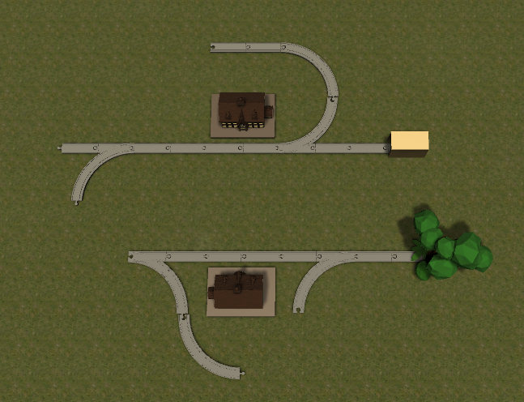
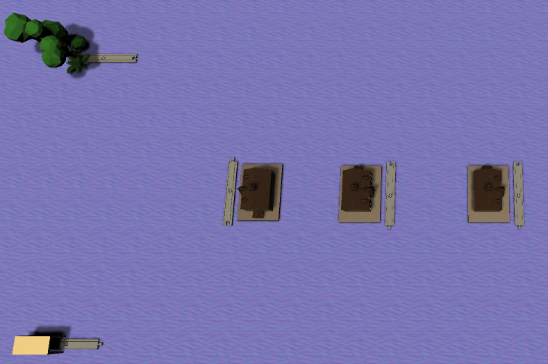
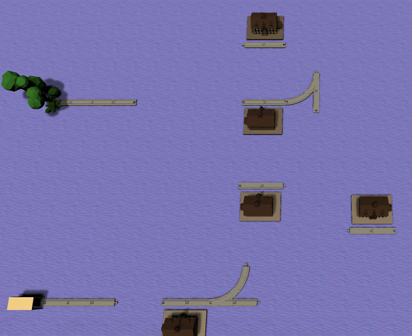

## Realtime Database
Wir benutzen die Echtzeit-Datenbank von Firebase. Zunächst wollen wir jedoch auf die Echtzeitfunktion verzichten und zu Testzwecken mithilfe eines [RestClients](https://assetstore.unity.com/packages/tools/network/rest-client-for-unity-102501) mit der Datenbank kommunizieren.

## Nutzung
Wir nutzen die Datenbank, um von außen erstellte Spielbretter und dazugehörige Aufträge zu laden.

## Datenzustand
Ein Spielbrett muss in einem eindeutigen Unterverzeichnis der Datenbank hinterlegt werden und besteht aus einem kryptischen String für den Aufbau des Spielbretts (Boardstring) und einem kryptischen String für den Auftrag (Missionstring). Die Gültigkeit der geladenen Informationen sollte anschließend clientseitig noch einmal geprüft werden.

Ein Boardstring wird mit `"Board:"` eingeleitet, gefolgt von einer Aneinanderreihung von Codes zu den im Brett angelegten Kontrollstrukturen (Structurecodes). Die einzelnen Structurecodes werden durch ein ";" voneinander getrennt. Ein Structurecode enthält Informationen über die Ursprungskoordinate im Grid (jeweils ein Eintrag für X und Y Koordinate), die in einer [Tabelle](Schienenelemente) definierte ID der darzustellenden Kontrollstruktur und die Rotation der Kontrollstruktur (0, 90, 180 oder 270). Die beiden Informationen werden durch einen "." getrennt. Also zum Beispiel: `"Board:2.6.0.0;6.6.0.0;10.6.0.0"`

Ein Missionstring wird mit `"Mission:"` eingeleitet, gefolgt von einer Aneinanderreihung von Codes zu den im Auftrag vorgesehenen Teilmissionen (Missionscodes). Die einzelnen Missionscodes werden durch ein ";" voneinander getrennt. Ein Missionscode enthält Informationen über die Menge mit der das ein Bahnhof angefahren werden muss. Die beiden Informationen werden durch einen "." getrennt. Also zum Beispiel: `"Mission:5;7"`.Die Reihenfolge der Einträge verweist dabei auf den entsprechenden Bahnhof. Der erste Eintrag verweist auf den ersten Bahnhof, der zweite auf den zweiten usw.

## Hinzufügen und Abrufen von Daten
Mithilfe des [RestClients](https://assetstore.unity.com/packages/tools/network/rest-client-for-unity-102501) geschieht das Hinzufügen von Daten ganz einfach nach dem folgenden Muster:

`RestClient.Put(connectionstring +  boardNumber + ".json", new Board());`

...wobei ein Board-Objekt einen Missionstring und einen Boardstring enthält.

Das Abrufen von Daten wird so ermöglicht:

`RestClient.Get<Board>(connectionstring +  boardNumber + ".json").Then(response => {
      staticBoard = response
});`

...wobei das Feld `staticBoard` global angelegt wurde.

## Allgemein
Ein Spielbrett kann nun nach der zuvor definierten Methode aus der Datenbank gelesen werden und Beispielsweise per Knopfdruck geladen werden.

## Prüfung
Eine Prüfung über den gültigen Zustand des Datenbankeintrags erfolgt noch implizit und sollte in Zukunft ohnehin darüber sichergestellt werden, dass Spielbretter nur über den Leveleditor in die Datenbank geladen werden sollen, wobei der Leveleditor bereits schon einige Prüfungen abdeckt.

## Beispiele
Ein einfaches Beispiel für ein aus der Datenbank geladenes Spielbrett kann folgendermaßen aussehen.



Der Board-String ist entsprechend: `"Board:2.6.0.0;6.6.0.0;10.6.0.0"`

Es folgt eine Liste der Karten im fertigen Spiel, in Verbindung mit ihren Board-und Mission-Strings. Dargestellt ist jeweils nur die Client-Seite der Karte, welche an Ihren negativen Y-Koordinaten erkennbar im Board-String ist.

### Map1



```
"Board:40.16.20.270;46.16.11.90;46.22.10.180;50.22.0.0;54.22.30.0;58.22.0.0;64.22.5.270;" +
"40.-38.6.90;62.-32.21.270;46.-38.11.90;46.-32.10.180;50.-32.30.0;54.-32.0.0;58.-32.0.0"

"Mission:4;3"
```

### Map2



```
"Board:32.16.20.270;64.22.5.270;36.16.16.180;40.16.30.0;44.16.17.0;46.22.11.0;36.22.11.270;" +
"42.22.0.180;50.16.11.90;50.22.10.180;54.22.0.0;58.22.0.0;"   +
"32.-34.6.90;62.-28.21.270;36.-34.16.180;40.-34.30.0;44.-34.17.0;46.-28.11.0;36.-28.11.270;" +
"42.-28.0.180;50.-34.11.90;50.-28.10.180;54.-28.0.0;58.-28.0.0"

"Mission:10;9"
```
       
### Map3


     

```
"Board:32.16.20.270;36.16.0.0;42.16.11.90;42.20.18.270;46.22.30.0;50.22.0.0;" +
"42.24.0.270;42.30.5.180;56.22.5.270;" + 
"32.-44.6.90;36.-44.0.0;42.-44.11.90;42.-40.18.270;46.-38.0.0;50.-38.0.0;42.-36.30.270;" +
"42.-30.10.180;56.-38.11.90;56.-34.0.270;56.-30.16.90;46.-30.0.0;50.-30.0.0;56.-26.21.180"

 "Mission:3;5"
```

### Map4
            


```
"Board:56.26.20.90;48.26.30.180;56.20.5.270;50.20.15.180;" +
"46.20.30.0;42.20.18.0;52.26.15.0;40.26.17.180;34.26.10.90;34.32.10.180;52.32.10.270;" +
"38.32.0.0;42.32.0.0;50.14.11.90;" +
"56.-34.6.270;48.-34.30.180;44.-34.0.180;54.-40.21.270;50.-40.15.180;" +
"46.-40.30.0;42.-40.18.0;52.-34.15.0;40.-34.17.180;52.-28.10.270;46.-28.0.0;44.-46.11.180"

"Mission:6;1;9;0"
```

### Map5


            
```
"Board:26.12.20.270;26.30.5.90;36.20.30.270;46.22.30.90;54.22.30.90;" +
"26.-48.6.90;28.-30.21.90;36.-40.30.270;46.-38.30.90;54.-38.30.90"

"Mission:16;5;6;25;12;1"
```
            
### Map6



```
"Board:26.12.20.270;30.12.0.0;56.18.30.180;38.12.30.0;26.30.5.90;46.36.30.180;" +
"44.22.30.0;42.12.17.0;44.30.30.0;50.30.16.90;32.30.0.180;" +
"26.-48.6.90;30.-48.0.0;56.-42.30.180;38.-48.30.0;28.-30.21.90;46.-24.30.180;" +
"44.-38.30.0;42.-48.17.0;44.-30.30.0;50.-30.16.90;32.-30.0.180", 

"Mission:10;9;12;1;8;12;6;9;4;10"
```
