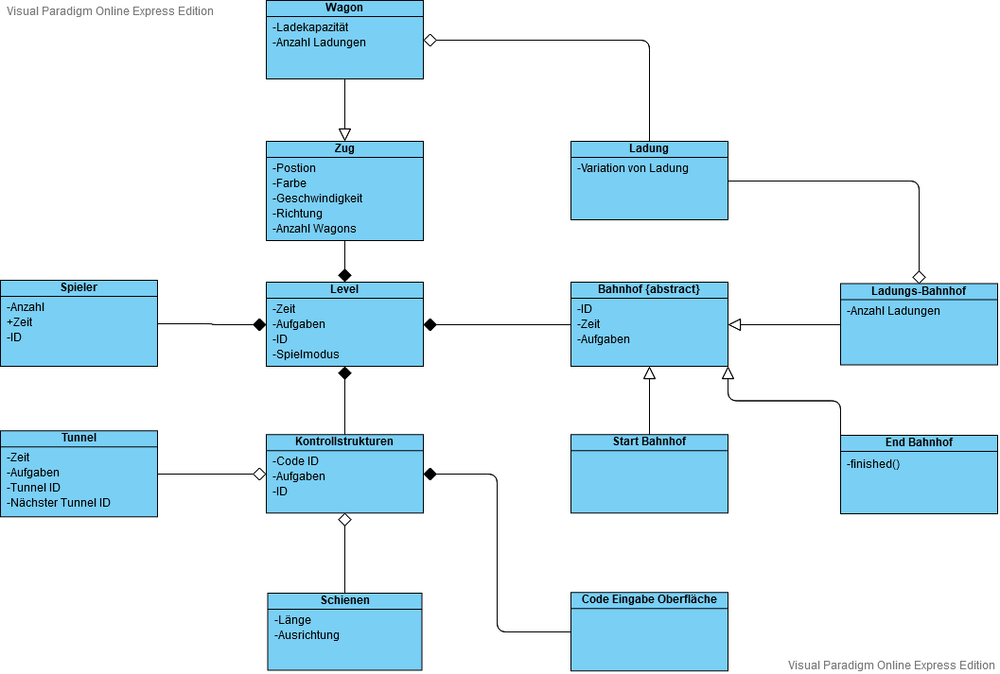

Inhaltsverzeichnis 
- [Vorläufiges Klassendiagramm](#vorläufiges-klassendiagramm)
- [Wagon](#wagon)
- [Zug](#zug)
- [Level](#level)
- [Spieler](#spieler)
- [Ladung](#ladung)
- [Ladungs Bahnhof](#ladungs-bahnhof)
- [Bahnhof {abstract}](#bahnhof-abstract)
- [End Bahnhof](#end-bahnhof)
- [Start Bahnhof](#start-bahnhof)
- [Code Eingabe Oberfläche](#code-eingabe-oberfläche)
- [Kontrollstrukturen](#kontrollstrukturen)
- [Schienen](#schienen)
- [Tunnel](#tunnel)

## Vorläufiges Klassendiagramm
Das nachfolgende Klassendiagramm ergab sich aus dem ersten Sprint. Da wir zu dem Zeitpunkt noch nicht angefangen hatten zu programmieren, dient dieses Klassendiagramm lediglich zu Orientierung. Letztlich hat sich herausgestellt, dass wir die Klassen nicht so realisieren konnten, wie wir es gewohnt waren. Entsprechend hat dieses Klassendiagramm nichts mehr mit unserer Klassen Struktur zu tun. Jedoch hat uns dieses am Anfang einen sehr guten Überblick über die Objekte und die Vorstellung des Spieles gegeben. Viele der Ansichten, welche wir am Anfang hatten, wurden im laufe des Spieles überdacht und anders gestaltet. 

## Wagon
#### Was wir uns am Anfang überlegt haben 
Die Überlegung war, dass wir an einen Zug mal mehr, mal weniger Wagons dranhängen, welche die Ladung aufnehmen. Hierbei hatten wir auch gedacht, die Ladung interaktiv auf den jeweiligen Wagon zu laden, also dort wo noch Platz ist. Denn jeder Wagon hätte nur eine gewisse Anzahl an freien Plätzen für die Ladung bekommen. 
#### Wie wir es umgesetzt haben
Die Idee des Wagon wurde verworfen. Stattdessen nimmt der Zug nun eine Ladung automatisch beim Vorbeifahren an einem Bahnhof auf. 

## Zug 
#### Was wir uns am Anfang überlegt haben 
Der Zug sollte eine feste Geschwindigkeit besitzen, mit welcher dieser fährt. Anfangs stand noch die Überlegung im Raum, dass wir mehrere Züge fahren lassen, welche verschiedene Farben besitzen, so dass diese durch die Kontrollstrukturen gelenkt werden. Eine Richtung und Position wurde angedacht, weil wir dachten, dass wir diese für die Routenberechnung benötigen. 
#### Wie wir es umgesetzt haben
Der Zug hat eine Geschwindigkeit, die im Code gesetzt werden kann. Da wir nur mit einem Zug arbeiten, brauchten wir diesem auch keine Farbe mehr zu geben. Die Position des Zuges ist unerheblich geworden. Die Richtung genauso, denn der Zug folgt einer Strecke und bei dieser ist die Richtung fest vorgegeben. 

## Level
#### Was wir uns am Anfang überlegt haben 
Jedes Level sollte über eine Zeit verfügen, die gemessen wird. Auch sollte es pro Level eine eigene Aufgabe geben. Zudem sollten verschiedene Spielmodi ausgesucht werden können. 
#### Wie wir es umgesetzt haben
Ein Level hat nun keine Zeit mehr, da dieses Konzept herausgenommen wurde. Zu jeder Karte wird eine bestimmte Strecke aus der Datenbank heraus geladen. Dies wird über einen Namen gemacht. Jedes Level hat zudem eine eigene Aufgabe. Verschiedene Spielmodi wurden aufgrund der Zeit und Komplexität nicht mit eingeführt.

## Spieler 
#### Was wir uns am Anfang überlegt haben 
Die Spieler sollten anfangs eine Zeit bekommen, wie lange diese für das Spiel benötigen. Anhand dieser Zeit wollten wir eigentlich dann Punkte vergeben. Zudem sollte jeder Spieler eine ID zur Identifikation bekommen. Die Spieleranzahl sollte anpassbar sein.
#### Wie wir es umgesetzt haben
Im Laufe des Spiels haben wir uns entschieden, die Zeit erstmal nicht umzusetzen. Die Spieler haben auch keine ID, sondern sind entweder der Server oder ein Client. Die Anzahl von Spieler sind derzeit fest auf 2 gesetzt.  

## Ladung
#### Was wir uns am Anfang überlegt haben 
Es sollte verschiedene Variationen von Ladungen geben, welche aufgenommen werden können.
#### Wie wir es umgesetzt haben
Jeder Bahnhof hat seine individuelle Ladung, welche aufgenommen werden kann. 

## Ladungs-Bahnhof
#### Was wir uns am Anfang überlegt haben 
Ist identisch mit dem, wie wir es umgesetzt haben.
#### Wie wir es umgesetzt haben
Der Ladungs Bahnhof ist der einzige Bahnhof der noch integriert ist. Jeder Bahnhof hat einen individuellen Namen und eine individuelle Ladung bekommen. Entsprechend wurde hier die Anzahl der Ladungen realisiert. 

## Bahnhof {abstract}
#### Was wir uns am Anfang überlegt haben 
Am Anfang wollten wir eine abstrakte Klasse des Bahnhofes machen, da wir mehrere Arten von Bahnhöfen hatten. 
#### Wie wir es umgesetzt haben
Der Bahnhof wurde nicht mehr abstract gestaltet, da wir nur noch eine Form von diesem benutzen. 

## End Bahnhof
#### Was wir uns am Anfang überlegt haben 
Anfangs war die Überlegung vorhanden von einem zu einem anderen Bahnhof zu fahren. Entsprechend hatten wir uns hierfür Start und End Bahnhöfe überlegt. Der End Bahnhof sollte dabei eine Methode zum Beenden 
und zur Auswertung des Levels beinhalten. 
#### Wie wir es umgesetzt haben
Der End Bahnhof wurde durch eine End Schiene ersetzt. Die End Schiene hat jedoch die gleiche Methode wie wir es uns am Anfang überlegt haben. Nur dass es statt einer Methode ein Skript wurde, welche das Ende auslöst.

## Start Bahnhof
#### Was wir uns am Anfang überlegt haben 
Hier haben wir uns das gleiche wir bei dem End Bahnhof überlegt, nur ohne die Methode. 
#### Wie wir es umgesetzt haben
Der Start Bahnhof wurde durch eine Start Schiene ersetzt. 

## Code Eingabe Oberfläche 
#### Was wir uns am Anfang überlegt haben 
Anfangs wussten wir, dass wir eine Eingabefläche für den Code benötigen. Jedoch war es noch nicht ganz klar, wie diese aussehen soll, weshalb wir hier sonst nichts dahingeschrieben haben. 
#### Wie wir es umgesetzt haben
Eine Oberfläche für die Code Eingabe haben wir integriert. Hierbei kann man zwischen drei Kontrollstrukturen unterscheiden. Zu diesen kann man dann jeweils noch die Bedingung per Dropdown Menü auswählen. Hierbei wurden die Zahlen beschränkt, da die Routenberechnung überdurchschnittlich lange braucht. 

## Kontrollstrukturen
#### Was wir uns am Anfang überlegt haben 
Jede Kontrollstruktur bekommt eine ID, mit der man diese dann programmieren kann. 
#### Wie wir es umgesetzt haben
Die Kontrollstrukturen haben wir mittels Schienen und Tunneln umgesetzt. Die Attribute wurden nicht mehr benötigt. 

## Schienen
#### Was wir uns am Anfang überlegt haben 
Es war uns bewusst, dass jede Schiene in irgendeiner Form eine Richtung und eine Länge hätte haben müssen. Entsprechend wurde dies mit in die Klasse aufgenommen. 
#### Wie wir es umgesetzt haben
Bei den Schienen wurden einfach verschiedene angelegt. Die geraden und kurvigen Schienen haben hierbei jeweils eine Richtung. Die Länge ist bei beiden gleich geworden, zu dem sind diese nicht im Code, sondern im Prefab definiert worden. Jedoch umfasst die Kurve andere Grid Größen als die gerade Schiene, wodurch das Bauen der Strecke mit mehr bedacht erfolgen muss. 

## Tunnel
#### Was wir uns am Anfang überlegt haben 
Jeder Tunnel sollte eine eigene ID zum Auffinden besitzen, damit eine klare Zuordnung für die Jumps geschaffen werden kann. Zudem wollten wir diesen auch eine Zeit mitgeben, bei der man die Dauer von einem bis zu einem anderen Tunnel misst. 
#### Wie wir es umgesetzt haben
Man kann nun von einem Tunnel zu einem anderen springen. Zudem diesen die Tunnel als vierte Kontrollstruktur mit Jumps. Außerdem verbinden diese die Strecken von Spieler 1 zu Spieler 2. Die Zeit wurde ganz herausgenommen, wie auch die Aufgaben aus dem Tunnel.
