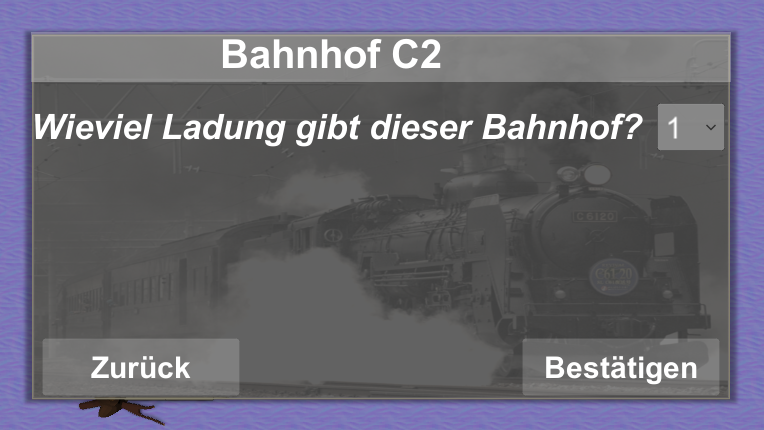

# Allgemein
Befindet man sich nicht im Löschmodus, lassen sich einige Kontrollstrukturen über die Betätigung der linken Maustaste auswählen, um spezifische Einstellungen zu treffen. In diesem Fall öffnet sich ein PopUp-Fenster, welches je nach Kontrollstruktur anders aussieht. Die Fenster werden im Folgenden erläutert.

## Weichen-Fenster
Im allgemeinen Weichen-Fenster kann man sich zwischen drei verschiedenen Weichen-Varianten entscheiden: For-Switch, While-Switch und If-Switch. While-Switch und If-Switch haben derzeit noch identische Auswirkungen auf das Spiel. Es ist jedoch denkbar in Zukunft mithilfe weiterer Prüfungen bei einer While-Switch zumindest zu unterscheiden, ob diese auch wirklich wie vorgesehen durchlaufen wurde, oder vor einer Umkehrung der Bedingung bereits verlassen wurde.

### If-und-While-Weichen-Fenster
Bei einer If-Weiche (sowie bei einer While-Weiche) lässt sich ein bestimmter Bahnhof auswählen, der auf seine Ladung hin überprüft werden soll. Anschließend kann entschieden werden, ob diese Ladung größer, kleiner oder gleich einer weiteren vom Nutzer einzutragenden Zahl sein muss, um die Bedingung wahr werden zu lassen und den Zug abbiegen zu lassen. Ist die Bedingung falsch, fährt der Zug geradeaus weiter. Wenn in der Weiche nichts eingestellt wurde fährt der Zug ebenfalls geradeaus.

### For-Weichen-Fenster
Bei einer For-Weiche lässt sich lediglich einstellen wie oft der Zug die Weiche passieren muss, um sie geradeaus durchfahren zu können.

## Bahnhof-Fenster
Bei einem Bahnhof lässt sich einstellen um wieviel sich seine Ladung jeweils erhöhen soll, wenn ein Zug an ihm vorbeifährt. Der maximale Wert ist hierbei 5. Der minimale Wert ist 1.

## Tunnel Eingang-Fenster
Bei einem Tunneleingang kann entschieden werden, welcher Tunnelausgang angefahren werden soll. Hierfür öffnet sich ein Dropdown-Fenster mit den Namen aller derzeit gesetzten Tunnelausgängen.

