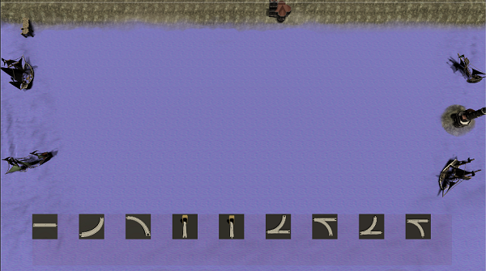
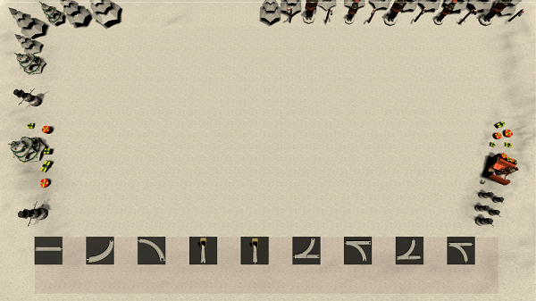
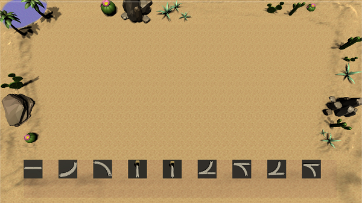
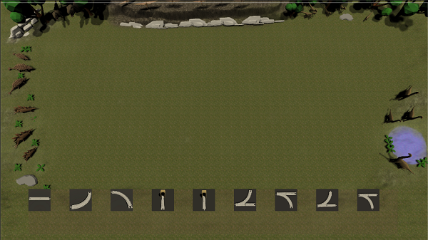
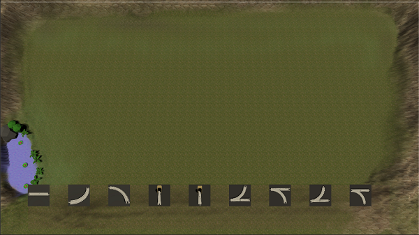
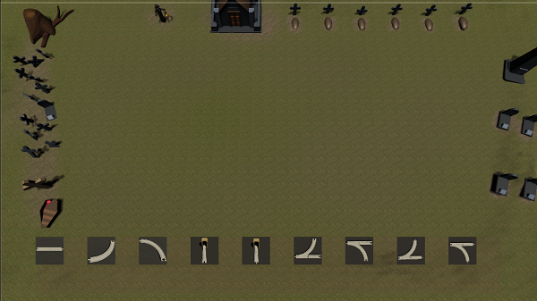

## Level  
Hier werden die 6 verschiedenen Level vorgestellt 

### Level 1
Das erste Level ist eine Art Wasser Level. Der großteil der Karte ist mit Wasser versehen, nur ein kleiner Teil der Karte beinhaltet eine Klippe, wo ein Steg und eine Kirche zu finden sind. Im Wasser auf dem Karten Rand befinden sich mehrere Schiffe und ein Leuchturm. Die Spielfläche befindet sich mit im Wasser, hier muss der Spieler auf einer Ebenen Fläche im Wasser Schienen setzten, welche auf eine Art Säulen im Wasser stehen.

### Level 2
Das nächste Level ist ein Weihnachts Level. Der komplette Boden ist hier mit Schnee bedekt, am Rand befinden sich Schnee Hügel und verschieden Dekorationen. Zu den Dekorationen gehören unter anderem Schneemänner, verschiedene Weihnachtsbäume, Geschenke, Nussknacker, der Schlitten vom Weihnachtsmann und Zuckerstangen. Nicht nur die Dekoration sorgt für eine weihnachtliche Stimmung sondern auch der Soundtrack "Oh Tannenbaum", welcher im Hintergrund abgespielt wird.

### Level 3
Level 3 ist ein Wüsten Level, welches komplett mit Sand und kleinen Sandhügeln am Rand überdeckt ist. Passend zu der Trostlosigkeit einer Wüste, wurde hier darauf geachtet nicht zu viel Dekoration zu benutzen. Der Rand wurde mithilfe verschiedener Kakteen, Steine und Palmen dekoriert. Es befindet sich am Rand auch eine kleine Oase.

### Level 4
Dieses Level wird "Dino Level" genannt, da es übersäht ist mit verschiedenen Dinos. Der Boden ist in diesen Level komplett mit Gras bedeckt, außer an der kleinen Trinkstelle und dem Berg. In diesem Level existieren die verschiedensten Dino Arten: Brachiosaurus, Stegosaurus, Ankylosaurus, Velociraptor, Pteradon und Tyrannosaurus Rex. Diese verschiedenen Dinos wurden passend zu ihren Arten platziert, z.B steht der Tyrannosaurus Rex versteckt im Wald und ist bereit, auf die Jagt nach anderen Dinos zu gehen, da er ein Carnivore ist. Zudem haben wir die beiden Herbivoren Stegosaurus und Ankylosaurus zusammen platziert, da sich diese Arten miteinander vertragen. Auch der Pteradon hat seinen Platz in den Hügeln, da dort das Nest vor Raubtieren geschützt ist. 

### Level 5
Level 5 wurde im Vergleich zu den anderen Level eher Schlicht gehalten. In diesem Level wurde weniger Dekorationen platziert. Der Rand der Map wird hier durch Berge markiert, sowie einem kleinen Wasserfall in dem sich mehrere Pflanzen befinden. Die Mitte der Map, welche die Spielfläche zum Platzieren der Schienen darstellt, ist mit einer Grastextur verschönert worden.

### Level 6
Das letzte Level soll einen Verlassenen Friedhof darstellen, welcher von einem Grabwächter bewacht wird. Am Rand befinden sich diverse Gräber und Kreuze. Dabei fällt ein Grab besonders auf, bei dem der Sarg geöffnet wurde aber keine Leiche zu sehen ist...

## Verwendete Assets 
Nach ausführlicher Recherche haben wir uns (dort wo es möglich war) für Assets im Low Polygon Style entschieden, da dieser uns am besten gefallen hat. Zudem gab es zu diesem Stil sehr viele kostenlose Assets die wir für das Leveldesign verwenden können.

### Level 1
* Design Idee: Schiffe 
* https://brokenvector.itch.io/low-poly-brick-houses

### Level 2
* Design Idee: Winter
* https://brokenvector.itch.io/low-poly-winter-pack

### Level 3 
* Design Idee: Wüste
* https://runemarkstudio.com/unity-assets/polyenvironment/

### Level 4
* Design Idee: Dino Wald
* https://korveen.itch.io/lowpoly-environment-pack
* https://www.youtube.com/watch?v=6Vza32Ld87o 

### Level 5
* Design Idee: Kristalle und Bäume und Steine 

### Level 6
* Design Idee: Friedhof
* https://assetstore.unity.com/packages/3d/characters/humanoids/fantasy/lowpoly-medieval-plague-doctor-free-pack-176809
* https://assetstore.unity.com/packages/3d/environments/dungeons/low-poly-simple-graveyard-134110

### Zug
* https://www.turbosquid.com/3d-models/3d-model-locomotive-pack-1394925

### Schienen
* https://www.thingiverse.com/thing:1938409

### Bahnhof
* https://assetstore.unity.com/packages/3d/environments/low-poly-ultimate-home-pack-164671

### Tunnel
* https://assetstore.unity.com/packages/3d/prototyping-pack-free-94277

### Musik
* https://www.musicfox.com/info/kostenlose-gemafreie-musik.php

### Buttons 
* https://assetstore.unity.com/packages/2d/gui/icons/jelly-icons-99749
* https://assetstore.unity.com/packages/2d/gui/icons/simple-icon-pastel-tone-107568

### Zug Bild
* https://pixabay.com/photos/japan-train-railroad-railway-steam-82123/

### Zug Dampf
* https://assetstore.unity.com/packages/essentials/tutorial-projects/unity-particle-pack-127325

**Hinweis**: In den verschiedenen Levels können auch Objekte von anderen Assets vorkommen. Die zu dem Level zugehörigen Assets dienen als Vorstellung, in welche Richtung das Aussehen gibt. Beispiel: Level 2 ist winterlich. 