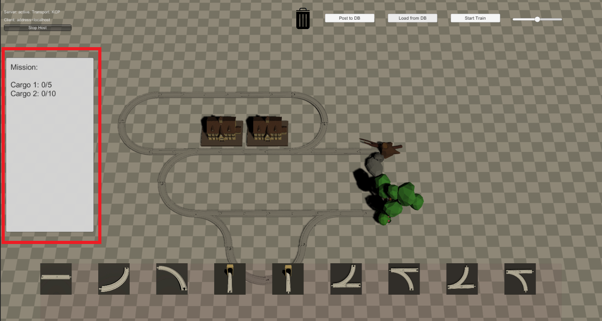

# Allgemein
Zu jedem Spielbrett existiert nun in der Datenbank auch eine Vorgabe zu einer entsprechenden Mission. Beim Laden des Spielbretts wird auch die Mission geladen und angezeigt.

## Das Missionsfeld
Das Missionsfeld befindet sich im Spiel am linken Bildschirmrand. Jedesmal wenn der Zug einen Bahnhof passiert erhöht sich die Ladung um einen vorgegebenen Betrag. Entspricht die Ladung an allen Bahnhöfen der den Vorgaben der Mission und erreicht der Zug anschließend das Ziel, so ist die Mission erfüllt.

## Siegschriftzug
Bei Erfüllung der Mission erscheint ein großer Schrifttzug: "Gewonnen!".