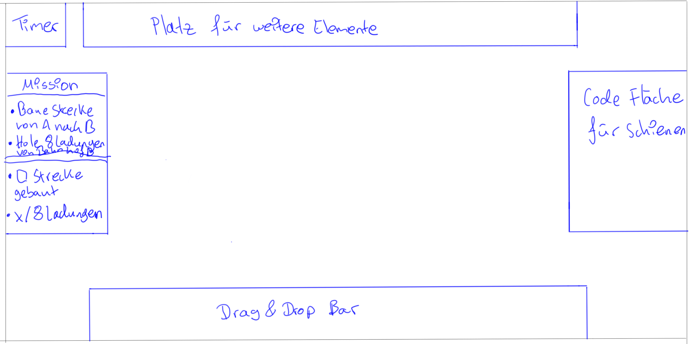
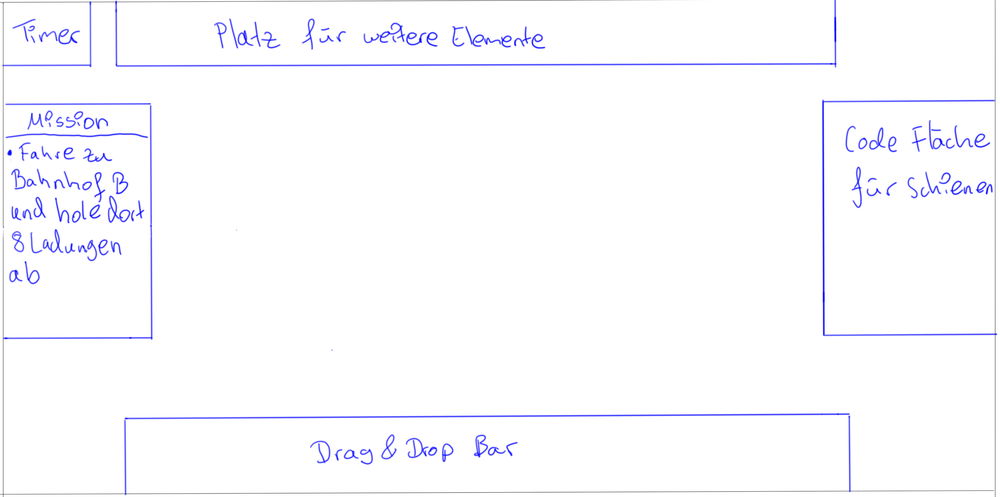
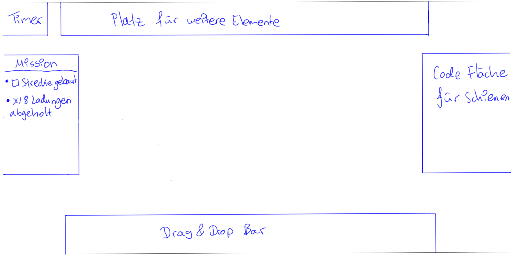
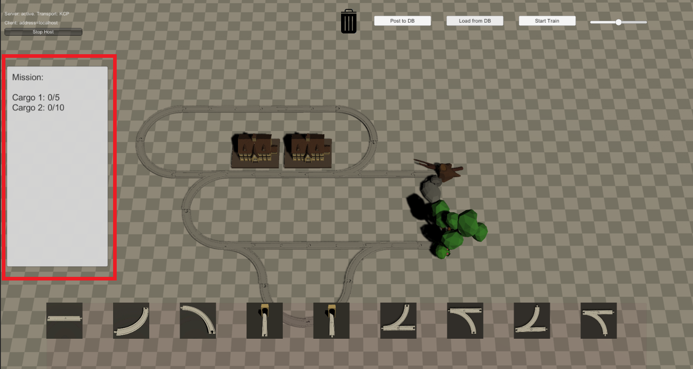

Inhaltsverzeichnis 
- [Allgemein](#allgemein)
- [Mission Ideen](#mission-ideen)
- [Überlegungen](#überlegungen)
- [Mockups für die Missionen](#mockups-für-die-missionen)
   - [Entwurf 1](#entwurf-1)
   - [Entwurf 2](#entwurf-2)
   - [Entwurf 3](#entwurf-3)
- [Missionen im Spiel](#missionen-im-spiel)
   - [Das Missionsfenster](#das-missionsfenster)
   - [Mission erfüllen](#mission-erfüllen)
# Allgemein
Missionen sind Aufgaben, welche während eines Levels erfüllt werden müssen. Man baut die fehlenden Schienen Teile dazu und schreibt den Code. Am Ende fährt der Zug durch die Strecke und sobald dieser am Endpunkt ankommt, wird geschaut, ob die Aufgabe korrekt erledigt wurde. Zur Überprüfung kann einfach nachgeschaut werden, ob die Ladungen im Zug mit dem der Aufgaben Anforderung übereinstimmt.
Hinweis: Diese sind derzeit noch nicht implementiert, folgen jedoch in kürze. 

# Mission Ideen
- Eine Mission startet an einem Startbahnhof und endet an einem Endbahnhof
- Während der gesamten Mission läuft ein Timer der die Zeit misst
- Es wird einmal gemessen wie lange man benötigt das Level zu lösen und wie lange der Zug benötigt vom Startbahnhof zum Endbahnhof zu fahren 
- An einem Ladungsbahnhof kann man die zu diesem Bahnhof zugehörige Ladung abholen
- Wenn man an einem Ladungsbahnhof vorbeifährt kann man nur eine Ladung abholen, dadurch ist man gezwungen Schleifen zu verwenden
- In einer Mission kann es mehr als einen Ladungsbahnhof geben, wodurch es verschiedene Arten von Ladungen gibt
- Je nach Schwierigkeitsgrad kann es mehrere Ladungsbahnhöfe geben

# Überlegungen
- Müssen Aufgaben zu 100 % erledigt werden, damit man ein Level schaffen kann?
- Hat man unendlich viel Zeit zum Level-Bau?
- bekommt man Teilpunkte, wenn man es vom Startpunkt bis zum Endpunkt geschafft, aber ohne dabei die Aufgabe zu erledigen?
- Hat man einen Zug oder mehrere?
- Was ist genau die Ladung? (Passagiere oder Ladung?)

# Mockups für die Missionen
Für die Mockups der Missionen haben wir uns an den bereits erstellten [Mockups](MockUps) orientiert und um Missionen erweitert. Im folgenden haben wir 3 Entwürfe für erstellt, wie genau eine Missionen dargestellt werden kann.

## Entwurf 1
Hier wurde zwischen Missionsziel und Missionsstatus unterschieden. Wenn man zB. eine Ladung hat oder die Schienen gelegt hat, wird der entsprechende Punkt abgehakt bzw. die vorhandene Ladungszahl wird aktualisiert. Die dynamische Ladungszahl ist hier mit einem x dargestellt. Dieser Entwurf fasst die Entwürfe 2 und 3 zusammen.

## Entwurf 2
Hier wurden aus dem Entwurf 1 nur die Missionsziele angegeben.

## Entwurf 3 
Hier wurde aus dem Entwurf 1 nur der Missionsstatus abgebildet.

## Missionen im Spiel 
Beim Laden eines Spielbretts wird nun auch eine Mission geladen und angezeigt

### Das Missionsfenster 
Das Missionsfenster befindet sich am linken Bildschirmrand und enthält Informationen über den aktuellen Stand der Ladungen an de Bahnhöfen, sowie die nötige Anzahl zum Erfüllen der Mission.

### Mission erfüllen 
Eine Mission ist erfüllt, wenn alle Ladungen auf dem vorgegebenen Stand sind und der Zug in das Streckenende einfährt.