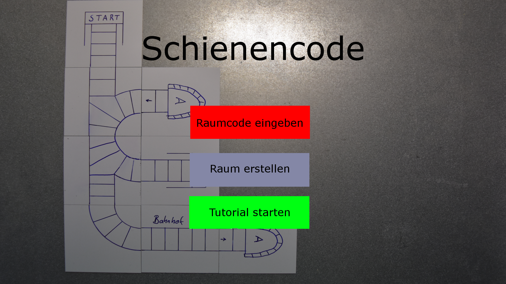

# Startbildschirm

* Textfeld "Raumcode" zur Eingabe eines bestehenden Raumcodes, tritt der Lobby bei
* Button "Raum erstellen" erzeugt eine Sitzung und wartet in der Lobby auf die Mitspieler
* Button "Tutorial starten" startet das Tutorial im Singleplayer

# Lobby

* Überschrift zeigt Raumcode an
* Liste der Spieler in der Lobby werden angezeigt
* Button "Spiel starten" wird freigegeben sobald alle Spieler in der Lobby sind
  * Wenn keine weiteren Spieler in der Lobby sind kann das Spiel als Singleplayer gestartet werden.

# Spieloberfläche

* untere Leiste enthält Schienenbauteile zum Bauen der Strecke
  * gegebenfalls Bauteilanzahl limitieren
* Aufgabe wird in der Seite eingeblendet
* Spielfläche ist eine angewinkelte Draufsicht
* Schienenbauteile können in einem Grid benutzt werden (evtl. auch direktes Snapping der Bauteile)
* oben Links wird der aktuelle Spielzeit eingeblendet und hochgezählt

# Score Board

* Nachdem alle Spieler die Aufgabe gelöst haben wird die Reihenfolge angezeigt. Der Schnellste gewinnt.
* Unten rechts gibt es einen Knopf zum starten des nächsten Level.

# Missionen
Diese finden sie [hier](Missionen).