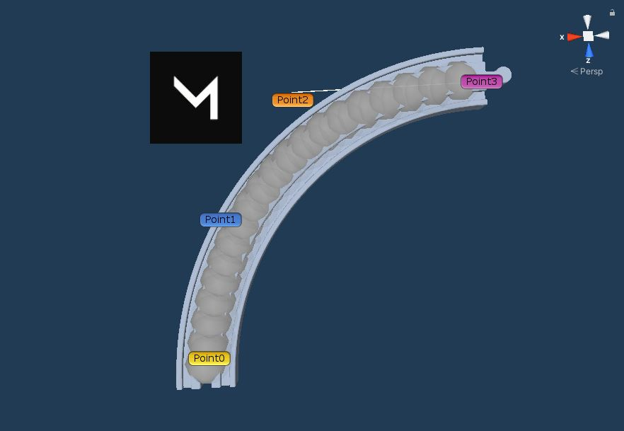

## Die Technik
  
Die Steuerung des Zuges erfolgt über festgelegte Bezieres-Kurven, die an den Schienen Prefabs angeheftet sind. Im Skript des Zuges wird eine Reihe von Kurven nacheinander angeheftet und dann abgefahren. Die Skripte sind aus diesem [Videotutorial](https://www.youtube.com/watch?v=11ofnLOE8pw) und wurden für 3D-Raum angepasst. Damit ist es unserem Zug möglich nicht nur Kurven zu fahren, sondern auch Höhenunterschiede wie zum Beispiel Brücken oder Berge zu überqueren. Zusätzlich wurde die Drehung des Zuges hinzugefügt. Die Geschwindigkeit des Zuges kann über das Lock-Prefab angepasst werden. Hierzu existiert die öffentliche Variable SpeedModifier im BezierFollow-Script.  
  
Hier ist zu sehen, wie sich die Route anhand der Routenpunkte 0 bis 3 bewegen lässt. Für die weitere Verwendung ist es wichtig, dass Point0 der Anfang und Point3 das Ende der Route ist.  

  
## Verlauf der Entwicklung
  
Im weiteren Verlauf der Entwicklung haben wir ein weiteres Skript geschrieben, um automatisch eine Route zu berechnen. Dabei hatten wir unter anderem Probleme mit den Schienen Prefabs. Hier mussten die Mittelpunkte exakter platziert werden und sie mussten mit Tags versehen werden. Beim Berechnen der gedrehten Schienen hatten wir Probleme mit leichten Rechenfehlern von Unity.  
Dies war unser erster Schritt:  

  
## Der Algorithmus zur Routenberechnung
  
Wir suchen uns die Startschiene und die Zielschiene mittels Tags heraus. Anschließend werden alle Schienen in einer Liste gespeichert und nacheinander durchgegangen. Anhand der aktuellen Schiene wird berechnet, wo sich die nächste Schiene befinden sollte. Wird die nächste passende Schiene gefunden, wird diese zur Route des Zuges hinzugefügt. Wenn es sich bei der gefundenen Schiene um die Zielschiene handelt, ist das Skript beendet. Wenn keine neue Schiene gefunden wurde, wird das Skript mit einer Fehlermeldung beendet.   

Nach Rücksprache mit den Tutoren wird um Endlosschleifen zu verhindern eine maximal überfahrene Schienenanzahl festgelegt. Diese wird auf 20 festgelegt.    

Es ist uns mit dieser Technik möglich Schienen, die frei und ohne Anschluss platziert wurden, zu ignorieren. Der Zug startet auch nur, wenn Start und Ziel verbunden sind. Damit wird ein Entgleisen unmöglich.  
  
## Fertige Routenführung 
  
