Für die Datenbank werden eindeutige IDs für jedes Schienenelement benötigt.

# Schienenelemente

---

| ID des Elements | Elementbeschreibung (Anschlussrichtung) |                            Bild |
| :-------------: | :-------------------------------------: | :----------------------------------------------------------: |
| 0 | Gerade Schiene (W -> O) | 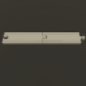 |
| 5 | in-Tunnel | 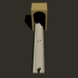 |
| 6  | out-Tunnel | 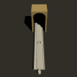 |
| 10 | Kurve (N -> W) |  |
| 11 | Kurve (S -> W) | 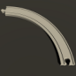 |
| 15 | Sammelschiene (N/W -> S) | 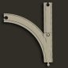 |
| 16 | Sammelschiene (N/O -> S) | 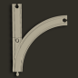 |
| 17 | Weiche (S -> N/W) | 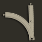 |
| 18 | Weiche (S -> N/O) | 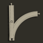 |
| 20 | Start | 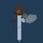 |
| 21 | Ende | 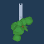 |
| 30 | Bahnhof | 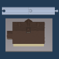 |
