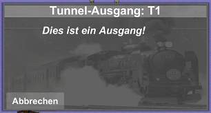

Inhaltsverzeichnis
- [Grundlagen](#grundlagen)
- [Ziel des Spiels](#ziel-des-spiels)
- [GUI](#gui)
- [Missionen](#missionen)
- [Bahnhöfe](#bahnhöfe)
- [Schienen platzieren und löschen](#schienen-platzieren-und-löschen)
- [Besondere Schienen](#besondere-schienen)

## Grundlagen

Willkommen im Spiel "Schienencode". Dieses Lernspiel dient der Vertiefung und Anwendung erlernter Kontrollstrukturen aus der Programmierung. 

## Ziel des Spiels

Ziel des Spiels ist es, den Zug vom Start bis zum Ende fahren zu lassen und dabei alle angezeigten Missionen abzuschließen. Um Missionen abzuschließen kann der Spieler Schienen platzieren und löschen, Weichen stellen und die Anzahl der Ladungen, die an einem Bahnhof abgeholt werden können, ändern.

## GUI

   
1: Missionsfenster    2: Löschmodus    3: Zug starten    4: Lautstärke    5: Hilfemenü    6: Schienenelemente 

## Missionen

Missionen sind der Schlüssel zum Sieg! Erreicht der Zug das Ende, bevor alle Missionen abgeschlossen sind, zählt dies als Niederlage.
Die abzuschließenden Missionen und der aktuelle Fortschritt werden an der linken Seite des Bildschirms angezeigt. 

## Bahnhöfe

Dreh- und Angelpunkt der Missionen sind Bahnhöfe. Dies sind die Gebäude, die verteilt am Streckenrand stehen. Ein Linksklick auf ein solches Gebäude offenbart ein Popup-Menü. Hier kann man einstellen, wie viel Liefergut von diesem Bahnhof eingesammelt werden soll, wenn der Zug daran vorbei fährt. Allerdings kann man nur begrenzt viel auf einmal einladen. Vielleicht kann man ja beim nächsten Besuch mehr abholen...?   
   

## Schienen platzieren und löschen

Natürlich ist nicht jede Strecke von Anfang an perfekt. Manchmal kann es vorkommen, dass die vorgegebene Strecke unvollständig ist. Dann liegt es am Spieler, die Strecke zu vervollständigen.   
Die Auswahl der Schienen erstreckt sich über den gesamten unteren Bildschirmrand. Hier kann zwischen Geraden, Kurven, Tunneln, Sammelschienen und Weichen ausgewählt werden.   

Hat sich der Spieler für ein Schienenelement entschieden, erscheint noch ein kleines Popup. Hier kann man das gewählte Element noch im oder gegen den Uhrzeigersinn rotieren und die Auswahl mit dem Häkchen bestätigen.
Wenn man jetzt die Maus über den Bildschirm bewegt, kann man bereits an einer kleinen Vorschau sehen, wo das gewählte Element platziert wird. Ist man mit der Position zufrieden, kann man die Schiene mit Rechtsklick platzieren.
Ist man mit der gewählten Position doch nicht so zufrieden, wie man vor der Platzierung dachte, ist das kein Grund zur Panik. Mit dem Mülleimer-Button am oberen Bildschirmrand kann man jederzeit selbst platzierte Schienen wieder mit Linksklick löschen. Vom Spiel vorgegebene Schienen sind nicht löschbar!   

*Löschmodus aus*   

*Löschmodus ein*

***Aber Achtung: Man kann im Löschmodus zwar weiterhin mit Rechtsklick Schienen platzieren, allerdings ist es nicht möglich, mit Bahnhöfen oder Weichen zu interagieren!***

## Besondere Schienen

Die Funktionen der meisten Schienen sind ziemlich selbsterklärend. Geraden und Kurven geben einfach nur die Strecke und Fahrtrichtung vor und Sammelschienen führen zwei verschiedene Strecken zueinander. Ein paar andere Schienen sind vielleicht nicht für jeden auf den ersten Blick eindeutig oder verstecken noch zusätzliche Funktionen...

### Start- und Zielschiene

Der Name ist ziemlich eindeutig. Vom Start fährt der Zug los und am Ziel soll er ankommen. Nur das Aussehen sollte einmal verdeutlicht werden. Nicht dass eine Strecke mal rückwärts gebaut wird...   
 

### Tunnel

Tunnel helfen dabei, einen Zug schnell von einem Punkt zu einem anderen zu transportieren und symbolisieren zusätzlich sogenannte "Jumps", wie man sie aus dem Programmieren kennt.
Es gibt jeweils einen Ein- und Ausgangstunnel, die separat platziert werden können. 
Mit beiden Tunneln kann mit Linksklick interagiert werden. Der Ausgangstunnel wird dann mitteilen, dass er ein Ausgang ist und zusätzlich eine kurze Kennung anzeigen. Diese ist dem Eingangstunnel wichtig, denn bei ihm kann man festlegen zu welchem Ausgang er führt. Dabei können mehrere Eingänge zum selben Ausgang führen, allerdings kann ein Eingang nicht mehrere Ausgänge haben.   
 

### Weichen

Weichen können vom Spieler platziert werden, um die Fahrtrichtung des Zuges festzulegen.   

*Achtung Verwechslungsgefahr: Weichen sehen Sammelschienen sehr ähnlich*

Nach der Platzierung einer Weiche hat diese erstmal keine Funktion. Dies lässt sich mit einem Linksklick beheben. Es erscheint ein Popup, bei dem man sich für einen von drei Typen entscheiden muss.   
   
*Es gibt 3 Typen: If-, While- und For-Weichen*

**If- und While-Weichen**   
In der aktuellen Version des Spiels haben If- und While-Weichen noch dieselbe Funktion, es ist jedoch denkbar in Zukunft mithilfe weiterer Prüfungen bei einer While-Weiche zumindest zu unterscheiden, ob diese auch wirklich wie vorgesehen durchlaufen wurde, oder vor einer Umkehrung der Bedingung bereits verlassen wurde.   
Bei diesen Weichen wird kontrolliert, wie viel eines ausgewählten Ladungstyps der Zug im Moment der Überfahrt transportiert. Ist die festgelegte Bedingung wahr, biegt der Zug ab. Ist sie falsch, fährt er weiter geradeaus.   
    
*Aktuell dieselbe Funktion: If- und While-Weichen*

**For-Weichen**   
Bei einer For-Weiche wird mitgezählt, wie oft der Zug diese Weiche passiert hat. Solange die Anzahl unter der angegebenen liegt, biegt der Zug ab. Ist sie erreicht, fährt er geradeaus.   
