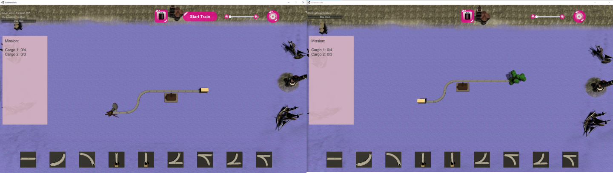

Inhaltsverzeichnis 
- [Die Spielidee](#die-spielidee)
- [Das Spielbrett](#das-spielbrett)
- [Der Spielmodus](#der-spielmodus)
- [Level](#level)

## Die Spielidee:
Der Spieler bekommt einen Auftrag und ein teilweise ausgefülltes Spielbrett vorgegeben. Ziel des Spiels ist es den Auftrag in Kooperation mit einem anderen Spieler zu erfüllen Der Auftrag sieht immer vor einen Zug durch die Spielebene zu navigieren, sodass dieser bei verschiedenen Bahnhöfen genug Ladungen aufnehmen und zum Zielort transportieren kann. Beim Durchfahren eines Bahnhofs wird dabei immer genau eine Ladung aufgenommen, es sei denn, an dem Bahnhof ist etwas anderes eingestellt. Der Spieler kann das Spielbrett in der Weise bearbeiten, dass dieser gewisse Schienenelemente einfügen und ihr Verhalten definieren kann. Zudem ist es möglich an einem Bahnhof eine andere Anzahl an aufnehmbarer Ladung einzustellen. 

## Das Spielbrett:
Das Spielbrett ist wie ein Grid in mehrere gleichgroße Quadrate unterteilt. Hierbei wird der Spielebereich durch Collider begrenzt. Dadurch kann der Spieler nur Schienen innerhalb einer gewissen Begrenzung platzieren. Bei Weichen muss der Spieler if-, while- oder for-Bedingungen definieren. Die Definition der Bauteile durch die Spieler beschränkt sich also nur auf die Bedingungen. 

## Der Spielmodus:
Es gibt zunächst nur einen Spielmodus: den kooperativen Modus mit 2 Spielern. Hierbei spielen die Spieler zusammen. Jeder Spieler besitzt eine eigene Karte mit einem Ausschnitt aus der gesamten Strecke. Die Strecken der Spieler sind dabei mit Tunneln verbunden. Zudem unterscheiden sich die Karten ein wenig voneinander. Jeder Spieler muss seine Strecke bauen. Sobald alle Spieler fertig gebaut haben, kann der Host den Zug starten lassen. Da diese Option nur dem Host zur Verfügung steht, müssen die Spieler auch miteinander kommunizieren. Wenn beide Spieler ihre Strecke richtig gebaut haben, gewinnen diese. Sollte jedoch einer der Spieler die Strecke falsch gebaut haben und das Missionsziel nicht erreicht werden, dann verlieren beide Spieler zusammen.   

#### Multiplayer 
Das Spiel ist ein kooperativer 2-Spieler Multiplayer. Bei diesen 2 Spielern gibt es einen Server und einen Host. Jeder von beiden spielt auf einer eigenen Karte. Jedoch haben beide die gleiche Mission, welche nur zusammen gewonnen werden kann.    
Der Server hat zudem mehr Rechte als der Client, denn er kann:
* den Zug starten lassen
* das Level zu der jeweiligen Karte laden
* das Spiel existieren lassen

Der Zug fährt bei dem Server los und endet bei dem Client. Wenn beide gewonnen oder verloren haben, ist es nötig, dass der Server auf den Bestätigen Button klickt, damit bei beiden das nächste Level geladen wird. 

## Level:
Jedes Level verfügt über eine andere Schwierigkeitsstufe. Hierbei ist Level 1 das leichteste und Level 6 das schwierigste Level. Jedes Level wird statisch erstellt. Es wird also nichts computergeneriert und bleibt beim erneuten Spielen gleich. Einzelne Features treten erst mit höherem Schwierigkeitsgrad auf. Das Look and Feel des Spielbretts ändert sich mit steigendem Schwierigkeitsgrad.

