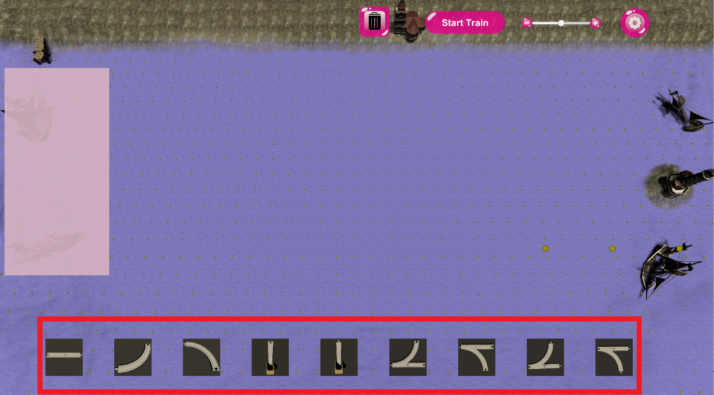
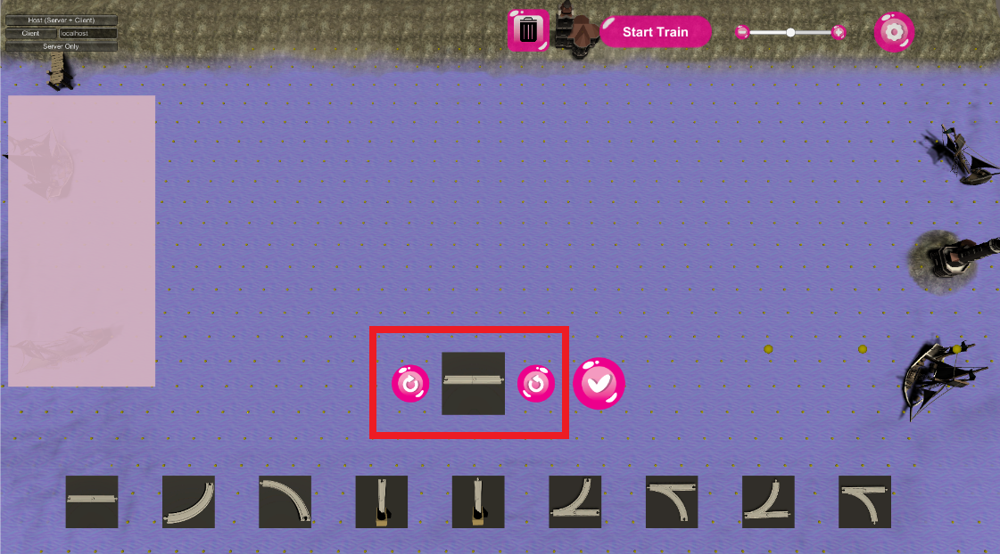
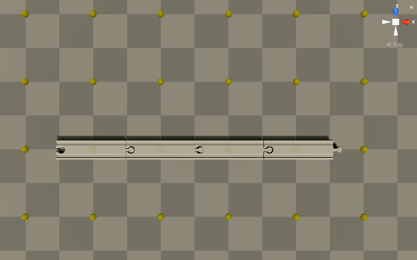
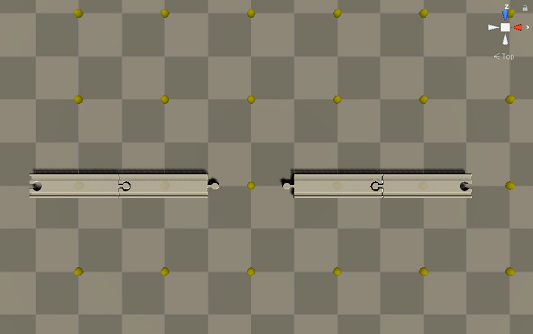
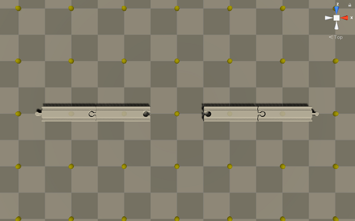
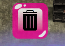
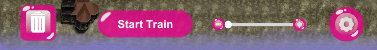

Inhaltsverzeichnis 
- [Allgemein](#allgemein)
- [Das Raster System](#das-raster-system)
- [Das Schienen Auswahl Menü](#das-schienen-auswahl-menü)
- [Anpassungs-Fenster](#anpassungs-fenster)
- [Objekt Vorschau](#objekt-vorschau)
- [Zoom Funktion](#zoom-funktion)
- [Schienen platzieren](#schienen-platzieren)
- [Regeln zum Schienen platzieren](#regeln-zum-schienen-platzieren)
- [Löschmodus](#löschmodus)
- [Hover Text](#hover-text)

# Allgemein
Am Anfang des Spieles ist das Spielfeld größtenteils leer. Während der ersten Phase des Spiels muss der Spieler eine Strecke aus Schienen für den Zug bauen. Hierfür nutzt der Spieler das Menü, welches im folgenden vorgestellt wird. Das Menü basiert auf einem Drag & Drop-Prinzip. Bei diesem Prinzip ist der Spieler jedoch an gewisse Spielregeln gebunden, welche im folgenden im Abschnitt "Regeln" erläutert werden. Die Position der Schienen wird mithilfe eines sogenannten Grid-Systems angepasst, sodass die Schienen einfach aneinander gereiht werden können. Hierbei belegt jedoch nicht eine Schiene ein Grid-Feld, sondern eine Schiene kann auch mehrere Grid-Felder groß sein. 

## Das Raster System
Ein Feld im Raster wird aus vier Kacheln gebildet. Der gelbe Punkt stellt hierbei die Mitte dieses Feldes dar. 

## Das Schienen Auswahl Menü 
Das Menü ist ein grafisches Steuerelement, siehe Bild "Menü". Hier sind alle platzierbaren Objekte zu sehen. Wenn man Beispielsweise eine gerade Strecke platzieren möchte, wie im Bild ganz links, muss man nur auf diese klicken und wird dann auf ein Anpassungs-Fenster weitergeleitet, bei dem man das Objekt im Hinblick auf die Drehung anpassen kann.

Schienen Auswahl Menü:

## Anpassungs-Fenster
Zu jedem platzierbaren Objekt existiert ein passendes Anpassungs-Fenster. Dieses erscheint, wenn man auf das Objekt-Bild klickt. Hier ist es möglich das Objekt mithilfe der Pfeil-Buttons zu rotieren. Wenn die gewünschte Rotation erreicht ist, kann man auf den Button Hacken drücken. Hierdurch entsteht das Objekt welches nun mit der rechten Maustaste positioniert werden kann. Damit der Spieler weiß, wo das Objekt ist, existiert eine Objekt Vorschau.

Bevor man auf einen der Pfeile geklickt hat

Nachdem man einmal auf einen der Pfeile geklickt hat

## Objekt Vorschau 
Es wird eine Vorschau von dem zu platzierenden Objekt erstellt. Dadurch sieht man, wo das Objekt platziert wird. Das Vorschau Objekt wird hierbei komplett in Weiß eingefärbt. Hierdurch ist eine Unterscheidung von den bereits platzierten Objekten möglich.

## Zoom Funktion
Damit der Spieler einen besseren Überblick über das Spielbrett hat, wurde eine Zoom Funktion eingebaut. Hierbei muss man  mithilfe des Mausrades näher rann zoomen und dann kann sich innerhalb des gezoomten Bereiches sich bewegen, in dem man die Mausradtaste gedrückt hält.

## Schienen platzieren
Um eine Schiene zu platzieren, muss man mit der Maus über eins der Felder im Raster gehen und mit rechter Maustaste platzieren. Die Schiene wird so genau in diesem Feld in der Mitte platziert.

## Regeln zum Schienen platzieren
Der Spieler ist beim Bauen der Strecke an bestimmte Schienen-Bau-Bedingungen gebunden. 
- Man kann keine zwei Objekte in irgendeiner Form übereinander platzieren.
- Die Schienen besitzen zwei verschiedene Enden, siehe Bild 1. Hierbei ist zu beachten, dass die Schienen mit dem richtigen Ende an eine neue Schiene angeschlossen werden, wie in Bild 1. Es ist nicht möglich die Schienen wie in Bild 2 oder 3 zu verbinden. Der Spieler muss entsprechend bei der Rotation von den Schienen auf die Anschlüsse achten.

Bild 1: Passend gelegt   

Bild 2: Nicht passend gelegt   

Bild 3: Nicht passend gelegt    

## Löschmodus
Am oberen Bildschirmrand befindet sich ein Mülleimer-Symbol, welches zu Beginn des Spiels schwarz gefärbt ist. Dies bedeutet, dass der Löschmodus deaktiviert ist und derzeit keine Kontrollstrukturen von dem Spieler gelöscht werden können. Wird das Symbol von dem Spieler mit per Mausklick ausgewählt, ändert sich die Farbe des Eimers auf weiß und der Löschmodus ist aktiv. Der Spieler kann nun mithilfe der linken Maustaste Kontrollstrukturen entfernen, die er selbst angelegt hat. Zu beachten ist hierbei, dass in diesem Modus keine Kontrollstrukturen mehr ausgewählt werden können, und dass Strukturen, die aus der Datenbank geladen wurden, von dem Spieler nicht gelöscht werden können. Nach erneutem Drücken auf das Eimer-Symbol deaktiviert sich der Löschmodus wieder.

#### Deaktivierter Löschmodus

#### Aktivierter Löschmodus neben anderen Inventarelementen

#### Schienen Löschen
Zum Löschen einer Schiene muss man mit der Maus über eine schon platzierte Schiene gehen. Danach muss man die linke Maustaste drücken und dann ist die Schiene gelöscht.

## Hover Text
Um einen Überblick der bereits gelegten Schienen zu bekommen, wurde ein Hover Text für die Schienen implementiert. Hierbei muss man einfach mit der Maus über die Schienen gehen und es erscheint ein kleiner Text, um welche Schiene es sich hier handelt. 

