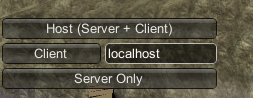
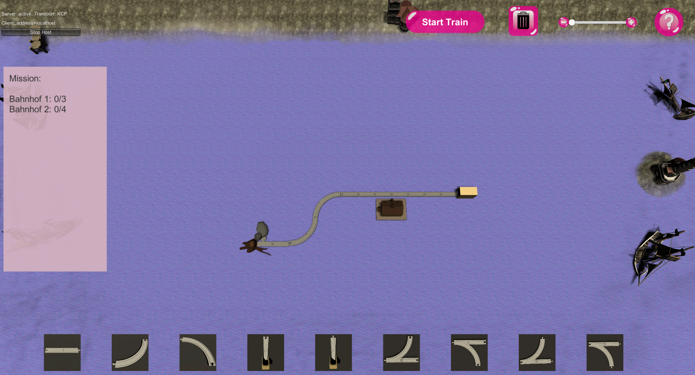
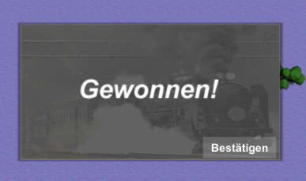
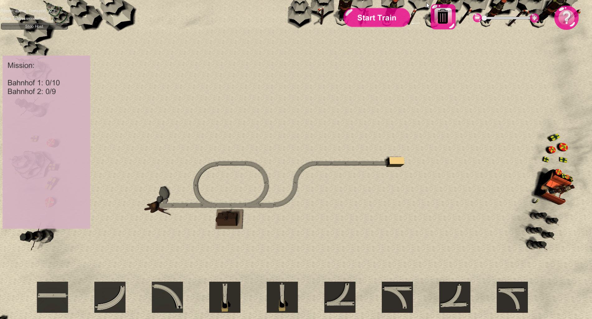

# User Stories

- Als Spieler kann ich Schienen platzieren um die Strecke des Zuges selbst zu erstellen.
- Als Spieler kann ich Weichen einstellen um Schleifen in der Strecke zu ermöglichen.
- Als Spieler kann ich das Stellverhalten der Weichen beeinflussen, um Einfluss auf den Spielverlauf nehmen zu können.
- Als Spieler kann ich an einem Bahnhof die Ladung variabel verändern, um eine Benutzereingabe in das Spiel zu ermöglichen.
- Als Spieler kann ich mit einem anderen Spielern das Spiel antreten, um gemeinsam die Mission zu bestehen.
- Als Spieler kann ich als Kontrollstrukturen Tunnel einsetzen, die jeweils zu einem anderen Tunnelausgang führen, um Sprünge des Zuges zu ermöglichen.
- Als Spieler kann ich sehen welches Schienenteil ich gerade betrachte, damit der Spieler mehr Übersicht über das Spielfeld hat.
- Als Spieler habe ich Zugriff auf verschiedene vorgegebene Karten, um ein umfangreiches Spielerlebnis erleben zu können.
- Als Spieler habe ich Zugriff auf eine Anleitung, um mich als Neueinsteiger mit den Spielmechaniken vertraut zu machen.

- Als Entwickler kann man bei einem Spielbrett eine Anzahl von maximalen Durchläufen festlegen, damit das Spiel definitiv beendet werden kann.

## Beispiel-Durchlauf

Das Spiel ist derzeit ausschließlich für zwei Spieler spielbar. Nachdem das Spiel geladen wurde gibt es für einen Spieler zwei Möglichkeiten. Entweder er versucht sich als Host, oder als Client in seinem Netz mit einem anderen Spieler zu verbinden. Der Default Wert der Netzverbindung ist "localhost". Ist bereits ein Host im Netzwerk vertreten, muss sich der Spieler als Client eintragen. Ist noch kein Host im Netzwerk, so muss einer der Spieler die Rolle übernehmen.

Nachdem der Client sich erfolgreich mit dem Host verbunden hat, wird das Spielbrett mit einer Verzögerung von 3 Sekunden geladen. Nun sehen beide Spieler die aktuelle Spielkarte, sowie links im Missionsfenster die aktuelle Mission. 

Die Aufgabe der Spieler ist es nun Einstellungen an der Karte vorzunehmen, sodass die Mission nach dem Durchlauf des Zuges erfolgreich abgeschlossen wird. Hierfür können von den Spielern Kontrollstrukturen eingebaut werden oder Definitionen an den Bahnhöfen bzw. [Kontrollstrukturen](Kontrollstrukturen) vorgenommen werden. Eine kurze Anleitung öffnet sich wenn der Spieler rechts oben auf das Fragezeichen-Symbol klickt (hier gehts zur [ausführlichen Version](Spieleanleitung)). 

Im Fall der ersten Karte müssen lediglich Einstellungen an den Bahnhöfen vorgenommen werden. Hierfür muss sich ein Spieler die Nummer seines Bahnhofs entweder durch die Hoveranzeige oder durch das Pop-Up nach Auswahl des Bahnhofs anzeigen lassen. Nun weiß er/sie, um welchen Bahnhof es sich handelt und kann einstellen um welchen Wert sich seine Ladung erhöhen soll, jedes mal wenn der Zug an ihm vorbeifährt. Sind die Einstellungen getroffen sollte der Client dem Host auf einem Kommunikationsweg seiner Wahl bescheid geben, dass dieser den Zug starten lassen kann. Nur der Host kann dies nämlich tun. Sind keine fehlerhaften Eingaben gemacht worden (wie zum Beispiel Endlosschleifen, Wege ins Nichts etc.), fährt der Zug nun los und die Missionsanzeige aktualisiert sich während seines Durchlaufs. Sind die Soll-Werte der Mission zum Zeitpunkt der Einfahrt des Zuges in die End-Schiene identisch zu den Ist-Werten, haben die Spieler das Spiel gewonnen und es erscheint eine entsprechende Anzeige.

Sobald der Host, diese Anzeige bestätigt, werden beide Spieler nach einer erneuten Verzögerung ins nächste Level weitergeleitet.

## Fehlerfälle:
### Verbindungsabbrüche:
- Wenn ein Spieler während des Spiels die Verbindung verliert oder das Spiel beendet, kann versucht werden die Verbindung wiederaufzubauen, auf den Spieler soll jedoch nicht gewartet werden. Der Spieler wird behandelt als wäre er „away from keyboard“.
- Bei einer erfolgreichen Verbindungswiederherstellung kann es dennoch zu Problemem führen, welche das Spiel in eine inkonsistenten Zustand bringen. In diesem Fall muss das Spieler derzeit noch neu gestartet werden.

### Fehlkonstruktionen:
- Leitet ein Spieler eine Zugstrecke ins nichts erhält er ein PopUp mit einer Fehlermeldung.
- Bei zu langen Schleifen oder Streckenkonstruktionen, wird beim berechnen der Route überprüft ob eine Schiene zu oft überfahren werden würde.
- Wenn ein Tunnel nicht mit einem anderen Tunnel Verbunden wurde, erhält der Spieler ein Fehlermeldung in einem PopUp.

## Besondere Situationen:
- Züge fahren an Weichen immer geradeaus, bis ein anderes Verhalten eingestellt wird.
- Weichen die ins nichts führen, jedoch nie in der Weise genutzt werden, dass ein Zug entgleist, sind grundsätzlich gültig.